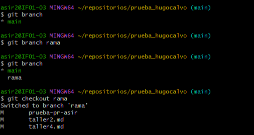
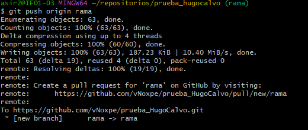
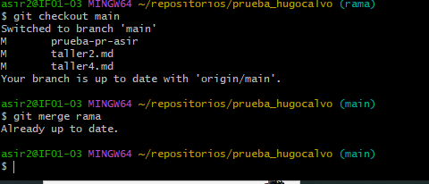

hacemos un git branch para ver la rama donde estamos 
despues hacemos el git branch rama para crear la rama
rama y cambiamos a la rama creada con git checkout rama

hacemos el git push orgin rama para descargar los cambios

por ultimo hacemos el git checkout main para volver a la rama principal
y el merge rama para fusionar las ramas 

