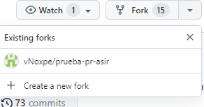
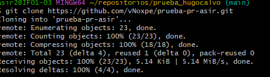
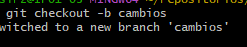
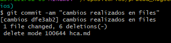
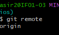
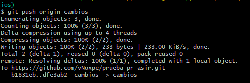
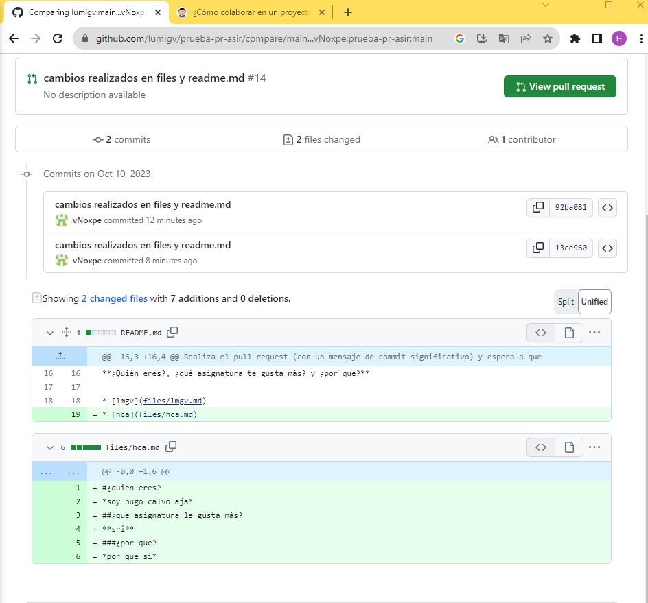

# Taller4.md
1. hacemos un fork

2. hacemos el git clone 

3. creamos la rama cambios

4. hacemos el comit

5. hacememos el  git remote origin

6. hacemos el git push origin

7.Hacemos el pull request

